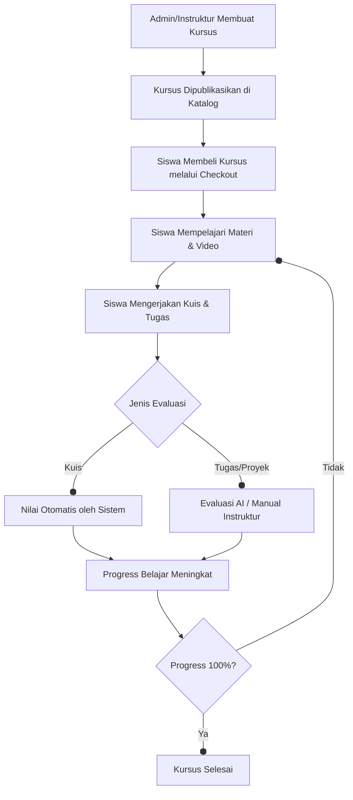

# Hybrid LMS (HLMS)


Hybrid LMS adalah Sistem Manajemen Pembelajaran (LMS) modern, tangguh, dan kaya fitur yang dibangun dengan **Laravel** dan **React**. Proyek ini dirancang untuk memberikan pengalaman belajar yang mulus dengan fitur bertenaga AI dan antarmuka pengguna premium.

## 🛠️ Teknologi Stack

### Backend
- **Framework**: [Laravel 12](https://laravel.com)
- **Authentication**: JWT (JSON Web Token)
- **Permissions**: Spatie Laravel Permission
- **Documentation**: Dedoc Scramble
- **AI Integration**: Echolabs Prism (Gemini/OpenAI)
- **Media**: Laravel FFmpeg & Intervention Image

### Frontend
- **Library**: [React 19](https://reactjs.org/)
- **Styling**: [Tailwind CSS 4.x](https://tailwindcss.com/)
- **State Management**: Redux Toolkit
- **Table Management**: TanStack Table
- **Icons**: Lucide React
- **Build Tool**: Vite

## 📥 Instalasi

Ikuti langkah-langkah berikut untuk menyiapkan proyek secara lokal:

### 1. Prasyarat
Pastikan Anda telah menginstal:
- PHP >= 8.2
- Composer
- Node.js & NPM
- MySQL atau database lain yang didukung

### 2. Clone Repositori
```bash
git clone <repository-url>
cd hybridlms
```

### 3. Setup Backend
```bash
# Instal dependensi PHP
composer install

# Salin file environment
cp .env.example .env

# Generate application key
php artisan key:generate

# Konfigurasi database di .env lalu jalankan migrasi
php artisan migrate --seed
```

### 4. Setup Frontend
```bash
# Instal dependensi JS
npm install

# Jalankan server pengembangan
npm run dev
```

### 5. Menjalankan Aplikasi
`composer.json` menyertakan skrip bantuan:
```bash
# Setup penuh (instalasi dan build)
composer run setup

# Jalankan semua secara bersamaan (Server, Vite, dan Queue)
composer run dev
```

---

## 🔑 Akun Demo

Gunakan akun berikut untuk mencoba fitur di lingkungan lokal atau demo. Semua akun menggunakan password default di bawah ini kecuali disebutkan lain.

| Role | Email | Password |
| :--- | :--- | :--- |
| **Super Admin** | `admin@hybridlms.com` | `password` |
| **Instructor (Simulation)** | `instructor@hybridlms.com` | `password` |
| **Student (Simulation)** | `student@hybridlms.com` | `password` |
| **Test Instructor** | `instructor@hlms.test` | `12345678` |
| **Test Student** | `student@hlms.test` | `12345678` |

> **Catatan**: Jalankan `php artisan db:seed` untuk memastikan akun-akun di atas tersedia di database Anda.

---

## 🌟 Fitur Lengkap

### 1. Manajemen Multi-Role
- **Admin**: Kontrol penuh atas sistem, manajemen pengguna, verifikasi instruktur, pengaturan komisi, dan proses payout.
- **Instruktur**: Membuat kursus, mengelola materi (video/teks/PDF), membuat tugas, dan memantau penghasilan.
- **Siswa**: Menjelajahi katalog, membeli kursus, belajar secara mandiri, dan mendapatkan feedback AI.

### 2. AI-Powered Grading (Fitur Unggulan)
- **Evaluasi Otomatis**: Menilai tugas dalam bentuk teks maupun file PDF secara otomatis menggunakan LLM (Gemini/OpenAI).
- **Feedback Detail**: AI memberikan ulasan mendalam tentang kualitas jawaban, logika pemrograman, atau kerangka penulisan.
- **Pengecekan Kode**: Mendukung analisis kode sumber untuk mata pelajaran pemrograman.

### 3. Marketplace & Sistem Keuangan
- **Katalog Kursus**: Sistem pencarian dan kategori yang responsif.
- **E-Commerce**: Fitur Keranjang belanja (Cart) dan Checkout yang terintegrasi.
- **Payout & Commission**: Sistem pembagian keuntungan antara platform dan instruktur yang transparan.

### 4. Classroom & Batch Management
- **Structured Learning**: Siswa dapat belajar dalam kelompok (batch) tertentu untuk pengalaman belajar yang lebih terorganisir.
- **Tipe Classroom (LMS Hybrid)**: Fitur khusus untuk pembelajaran tatap muka atau kelas terstruktur dengan dukungan kode kelas unik (`class_code`).
- **Kode Kelas**: Memungkinkan siswa untuk bergabung ke dalam kelas secara cepat menggunakan kode unik yang dibagikan oleh instruktur.
- **Manajemen Jadwal**: Mendukung pengaturan tanggal mulai, tanggal berakhir, serta periode pendaftaran yang spesifik untuk setiap batch.
- **Progress Tracking**: Pemantauan kemajuan belajar siswa secara real-time untuk setiap batch, memudahkan instruktur memantau performa kelas secara kolektif.

### 5. Media & Pengalaman Belajar
- **Optimasi Gambar**: Konversi otomatis ke format WebP untuk performa maksimal.
- **Video Integration**: Mendukung berbagai provider video untuk materi pembelajaran.
- **Responsive UI**: Antarmuka modern yang dioptimalkan untuk berbagai ukuran layar.

---

## 🔄 Alur Kerja Sistem (Business Process)



### Penjelasan Proses:
1.  **Persiapan Konten**: Instruktur menyusun kurikulum yang terdiri dari Section dan Lesson (Video, Teks, Tugas).
2.  **Transaksi & Akses**: 
    - **Self-Paced**: Siswa membeli kursus melalui marketplace dan akses terbuka setelah pembayaran.
    - **Classroom/Batch**: Siswa bergabung ke kelas tertentu melalui pendaftaran batch atau menggunakan **Kode Kelas** (`class_code`) yang diberikan pengajar.
3.  **Proses Belajar**: Siswa mengikuti alur pembelajaran. Sistem mencatat setiap pelajaran yang telah diselesaikan secara real-time.
4.  **Evaluasi AI**: Untuk tugas esai atau coding, instruktur dapat memicu **AI Grading Service**. Sistem akan mengekstrak konten dari file (termasuk PDF) dan mengirimkannya ke AI untuk dinilai berdasarkan rubrik yang telah ditentukan.
5.  **Penyelesaian**: Setelah semua materi dan tugas selesai, siswa dinyatakan lulus dari kursus tersebut.
6.  **Revenue Sharing**: Setiap transaksi yang berhasil akan dihitung komisinya untuk platform, dan sisanya menjadi saldo instruktur yang dapat ditarik (Payout).

---

## 📂 Project Structure

- `app/` - Core Laravel logic (Controllers, Models, Resources, Services).
- `app/Services/` - Logika bisnis utama termasuk **AiGradingService**.
- `resources/js/` - React frontend source code menggunakan Redux Toolkit.
- `database/` - Migrations dan Seeders (termasuk simulasi data AI).
- `routes/` - API dan Web route definitions.
- `config/` - Application configuration files.

## 📜 API Documentation

Setelah server berjalan, Anda dapat mengakses dokumentasi API di:
`http://localhost:8000/docs/api` (didukung oleh Scramble)

## 📄 License

Proyek ini dilisensikan di bawah lisensi MIT.
